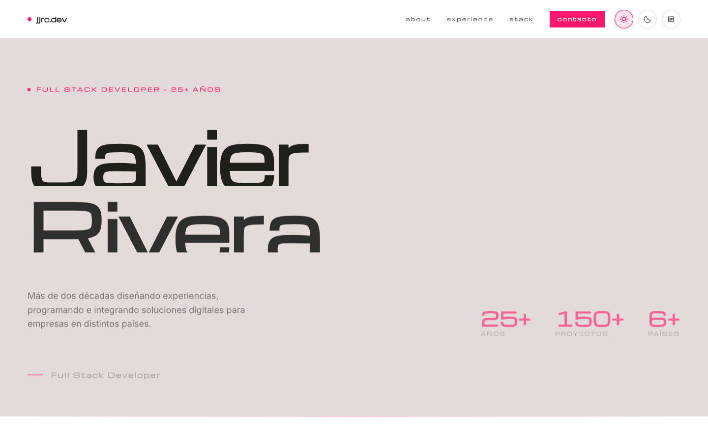

<div align="center">

# jjrc.dev

**Portfolio personal de Javier Rivera** — Full Stack Developer con 25+ años de experiencia en arquitectura de software, ecommerce, integraciones y desarrollo asistido por IA.

[jjrc.dev](https://jjrc.dev) · [Contacto](mailto:juan.javier.rivera.cardenas@gmail.com)




</div>

## Sobre el proyecto

Sitio estático de una sola página, sin frameworks ni build step: HTML, CSS y JavaScript vanilla. Prioriza carga rápida, accesibilidad y una estética editorial — tipografía grande, mucho espacio en blanco, acentos en rosa (`#ff176b`) y micro-interacciones cuidadas por sobre el "flashy motion".

## Características

- **Hero animado** — el título entra palabra por palabra con un efecto de cortina (`translateY` enmascarado), acompañado de un aura de gradiente que respira lentamente en el fondo.
- **Curtain reveal en scroll** — cada título de sección se envuelve en tiempo de ejecución (`IntersectionObserver`) y se revela con un barrido elegante la primera vez que entra en viewport.
- **Carrusel de testimonios** — de a 3 en pantalla (responsive: 3 → 2 → 1), con extracto siempre visible y cita completa desplegable al pasar el mouse (desktop) o al tocar (mobile).
- **Nube de tecnologías** — todas las herramientas y plataformas con las que se ha trabajado, agrupadas por peso visual.
- **Tema claro / oscuro** — toggle persistido en `localStorage`, con variables CSS (`:root[data-theme]`) para ambas paletas.
- **`llms.txt`** — resumen del sitio pensado para que agentes/LLMs indexen el perfil profesional sin tener que parsear el HTML completo.
- **`prefers-reduced-motion`** respetado en todas las animaciones.

## Stack

| Capa       | Detalle |
|------------|---------|
| Markup     | HTML5 semántico |
| Estilos    | CSS3 con variables nativas — sin preprocesador, sin Tailwind |
| Scripts    | JavaScript vanilla (IIFEs), sin dependencias de runtime |
| Animación de scroll | [AOS](https://michalsnik.github.io/aos/) para fades de entrada de bloques |
| Tipografía | [Michroma](https://fonts.google.com/specimen/Michroma) (headings) + [Inter](https://fonts.google.com/specimen/Inter) (cuerpo), vía Google Fonts |

## Estructura del sitio

El orden de las secciones está pensado desde la perspectiva de quien evalúa un perfil (reclutador/cliente): primero contexto rápido, después prueba social y evidencia de trabajo real, y al final el detalle técnico y personal.

```
01 — About          Quién soy, resumen de 25+ años
02 — Timeline        Evolución de la carrera por década
     Nube de conceptos   Tecnologías y herramientas usadas
     Testimonios         Recomendaciones de clientes/jefes de proyecto
03 — Work            Empresas, proyectos y clientes por industria
04 — Stack           Enfoque de arquitectura full stack
05 — Integrations    Ecommerce, pagos, logística, APIs a medida
06 — AI Dev          Flujo de desarrollo asistido por IA
07 — Recursos        Guías y plugins liberados a la comunidad WordPress
08 — Principles      Cómo trabajo
09 — Life            Fuera de la pantalla
     Contacto
```

## Estructura de carpetas

```
.
├── index.html                 # única página del sitio
├── llms.txt                   # resumen del perfil para LLMs/agentes
├── assets/
│   ├── css/styles.css         # todos los estilos, con temas claro/oscuro
│   ├── js/script.js           # AOS init, carrusel, reveal-mask, theming
│   └── img/                   # fotos de la sección personal
├── recursos/                  # guía de seguridad WP + plugin headless
├── downloads/                 # plugins y themes descargables
└── testimonios.md             # fuente de los testimonios (texto plano)
```

## Correr localmente

No hay build step. Cualquier servidor estático sirve:

```bash
python3 -m http.server 8000
# → http://localhost:8000
```

o simplemente abrir `index.html` en el navegador.

## Créditos

Diseñado y desarrollado por [Javier Rivera](mailto:juan.javier.rivera.cardenas@gmail.com), con ayuda de Claude Code y Pencil para el flujo de diseño-a-código.

© 2026 Javier Rivera. Todos los derechos reservados.
